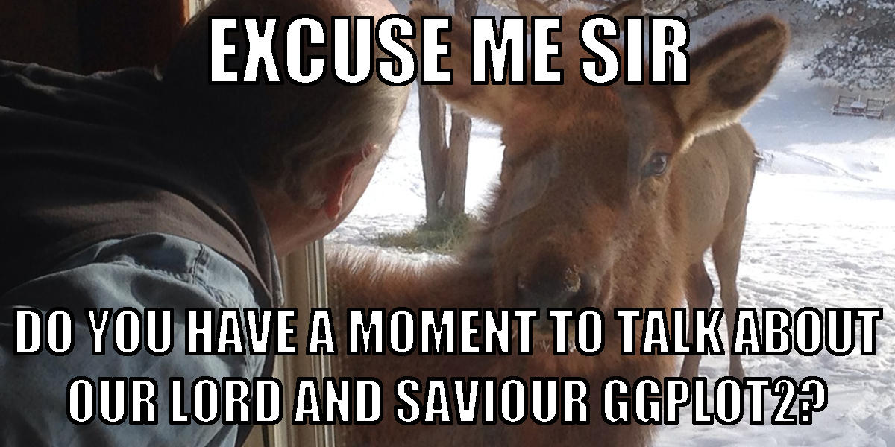

# Introducing ggplot and the grammar of graphics

__ggplot2__ is a package for producing high-quality graphics/charts/plots/maps from R. Sure, you can use base R functions for plotting, and your plots will definitely look like it. ggplot puts a lot of people off because of its complexity, but once you learn the basics of how it works, it's really pretty straightforward to use and very powerful.

source: [http://xkcd.com](xkcd.com)

### Useful online resources for explaining ggplot
- [https://ramnathv.github.io/pycon2014-r/visualize/ggplot2.html](Ramnath Vaidyanathan's R Introduction - Grammar of Graphics)
- [http://www.datacarpentry.org/R-ecology-lesson/04-visualization-ggplot2.html](Data Carpentry - Data visualization with ggplot2)
- [https://www.aridhia.com/technical-tutorials/the-fundamentals-of-ggplot-explained/](Aridhia - The fundamentals of ggplot2 explained)

## The Grammar of graphics
A grammar is basically a set of rules for how something is put together. The grammar of graphics is nothing more than a set of objects and rules for assembling graphics. The idea in creating the grammar of graphics was to create a structure that allowed for specifying, creating, and ordering every part of a graphic (graph or plot).

The basic unit in the grammar of graphics is a __layer__. A graph can have one or more layers. Each layer must have at least a __data and aesthetic mapping__ and a __geometry type__. Layers can also have additional attributes like statistical transformation and position adjustments.

### Helpful advice from the interweb
1. Quit using __qplot__. I ran across this quote on Ramnath Vaidyanathan's ggplot introduction: "... if there is one advice I could give you about learning ggplot2, it would be to stop reading examples using __qplot__ because it gives you the false impression that you have mastered the grammar, when in fact you have not. qplot provides some nice syntactic sugar, but is not the real deal."

2. Build your graphs iteratively. Don't string together a ton of ggplot layers all at once. It will be really hard to troubleshoot errors and figure out where/why different settings are inherited or not. Start simple and add complexity.
