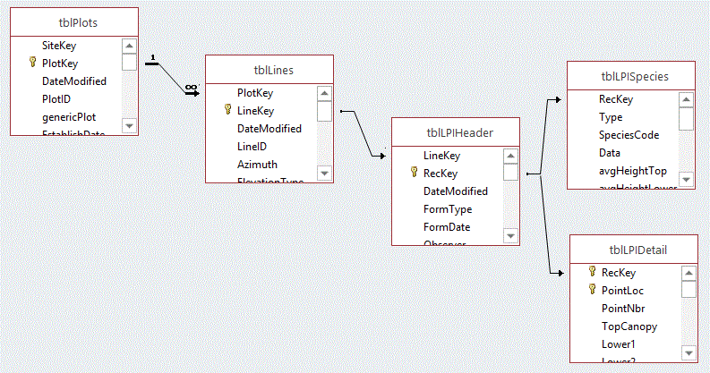
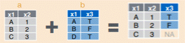
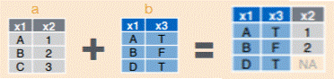
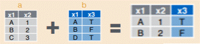
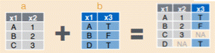

# Relational Database Concepts and SQL
Relational databases are common in ecological datasets because they're an efficient way to store data. However, for analyses, relational data can be a pain because you have to join or merge tables to get the data that you want all in the right places. There are many powerful relational databases (MySQL, Postgres, SQLServer, Access [_though I hesitate to include that one_]) and if you're dealing with very large and very dynamic data, investing in learning and using a relational database can really pay dividends. R, however, is an analysis package, so it doesn't do a stellar job with relational data right out of the box. There are, though, some really helpful packages for working with relational data. First, let's cover some relational database basics.

## Relational databases 101
Generally, databases are considered relational when data is stored across multiple tables that are linked by common fields/attributes. By filtering and joining tables based on these common fields, you can store data very efficiently and reconstruct any data configuration or summary you need.



Relationships between tables can be:
- one to one - each LPIHeader row has a SINGLE corresponding row in tblLPIDetail.
- one to many - each plot in tblPlots can have many lines (i.e., transects) in tblLines.
- many to one - multiple Lines can belong to a single plot (depends on the direction of the relationship - i.e., cardinality)
- many to many - pretty unusual in practice

Relational databases prevent redundancy in data storage and can be used effectively to improve data quality through lookup tables.

## Structured Query Language (SQL)
SQL is basically the language used for performing table operations on relational data. Common SQL uses are table filtering, joining, and data summarization. SQL is a very well-developed and extensive language and there are entire tomes devoted to its nuances. However, it's possible to accomplish a lot of what you want to do with just a few basic SQL statements.

SQL consists of
- __Statements__ - declarative code that tells the database you want to do something, but not necessarily exactly how to do it (though it will have defaults).
- __Clauses__ - modifiers or additional info on what you want to do and how.
- __Functions__ - code that takes arguments and returns values that can be used elsewhere.

__ A note on syntax and format:__ It is convention to write SQL statements in all UPPERCASE and table and field names in lower case (unless the table or field names have uppercase names). In a relational database, SQL statements are terminated by a semicolon (;). However, in R this will vary by package you're using. Comments in SQL are a bit different too. Single-line comments are made with double hyphens (--). Multi-line comments are offset by /* and \*/.

Consider these two data tables:
tblPlotCover - Plot Species Table

 PlotID | SppCode | Cover
 ---     | ---     | ---   
 Plot1   | BOGR2   | 23    
 Plot1   | BRTE    | 14    
 Plot1   | CAFI    | 2     
 Plot2   | ARTRV   | 31    
 Plot2   | NAVI4   | 7     
 Plot2   | ELTRT   | 6  
 Plot2   | PF01    | 17   

tblSpecies - Species Table

| SppCode        | ScientificName                   |
| :------------- | :-------------                   |
| ARTRV          | Artemisia tridentata vaseyana    |
| BOGR2          | Bouteloua gracilis               |
| BRTE           | Bromus tectorum                  |
| CAFI           | Carex filifolia                  |
| ELTRT          | Elymus trachycaulus trachycaulus |
| NAVI4          | Nassella viridula                |

### SELECT FROM statement and WHERE clause
The bread and butter of SQL is the SELECT FROM statement that pulls data from one or more tables. SELECT asks that you either specify the fields you want from each table or just use the wildcard character ( * ) for all fields. The WHERE clause adds filtering options to the query. The basic syntax is straight forward.
```
SELECT * FROM tblSpecies;   --This will return the entire table

SELECT SpeciesCode, ScientificName, CommonName FROM tblSpecies WHERE Duration='Perennial';   --This will return the code and names for perennial plants.
```

### SELECT DISTINCT
Sometimes you want to know how many unique values a field has or how many unique records a table has. You can use SELECT DISTINCT to do this.

```
SELECT DISTINCT Family FROM tblSpecies;    -- This will give a list of all the plant families in the table.

SELECT DISTINCT COUNT(Family) FROM tblSpecies;  -- Pair it with the COUNT function to get the number of distinct families!
```

### GROUP BY
GROUP BY is the SQL form of doing data summaries or pivot-style tables. You generally pair GROUP BY with a SELECT statement and some functions like COUNT, AVG, SUM, MIN, or MAX.

```
SELECT COUNT(SppCode) FROM tblPlotCover GROUP BY PlotID; -- Species Richness by plot

SELECT COUNT(SppCode) FROM tblPlotCover GROUP BY PlotID; -- Species Richness by plot
```


### ORDER BY
ORDER BY sorts your results, and can be a really useful clause to include in your SQL statements.

```
SELECT * FROM tblSpecies ORDER BY SppCode ASC;

SELECT * FROM tblPlotCover ORDER BY PlotID, SppCode ASC;
```

### LEFT JOIN or RIGHT JOIN
Joins are where the real magic of SQL happens. Joins basically let you merge attributes from one table into another based on a common field (relationship). The different types of joins are defined by how you're doing the join and which table you're joining into another.

One of the most common joins are the left and right joins. In a left join, all the records from the "left" table are kept and the attributes from the right table are added for records that are in common to both tables.

    

```
SELECT * FROM tblPlotCover LEFT JOIN tblSpecies ON tblPlotCover.SppCode = tblSpecies.SppCode;
```

Right join is just the opposite.



### INNER JOIN
Inner join is the set equivalent of an intersect in GIS. It will return the set of records that are common to both input tables.

    

```
SELECT * FROM tblPlotCover LEFT JOIN tblSpecies ON tblPlotCover.SppCode = tblSpecies.SppCode;
```

### FULL JOIN
A full join is the set equivalent of a union in GIS (_note though, that SQL has a UNION statement that does something different_). A full join will return a table that contains all records from both tables.

    
```
SELECT * FROM tblPlotCover FULL JOIN tblSpecies ON tblPlotCover.SppCode = tblSpecies.SppCode;
```
